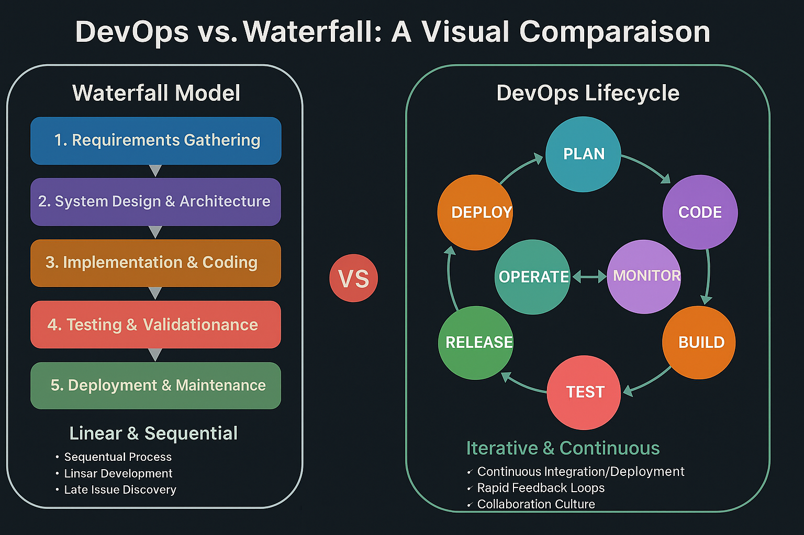

# Actividad 1: Introducción a DevOps y DevSecOps  

**Estudiante:** Emhir Rodríguez 
**Fecha:** 11/09/2025  
**Tiempo total invertido:** 00:00  

---

## Contexto del entorno  
El trabajo lo realicé en mi laptop con Windows 10, usando Visual Studio Code y el navegador Chrome.  
Para las evidencias utilicé herramientas básicas como DevTools (HTTP/TLS), nslookup (DNS) y netstat (puertos).  
  
## 4.1 DevOps vs Cascada tradicional  
**Explicación breve:**  
**cascada**: Este modelo sigue fases lineales; primero requisitos, luego diseño, después implementación, pruebas y recién al final despliegue.  
Funciona cuando los requisitos son estables, pero el problema es que el feedback llega tarde y corregir errores al final suele ser caro y lento.  

**DevOps**:Busca trabajar en ciclos más cortos y repetitivos. Se apoya en integración y despliegue continuo (CI/CD), pruebas automatizadas y colaboración entre desarrollo y operaciones. Esto permite detectar fallos antes, entregar más rápido y adaptarse mejor a los cambios.  

**Situaciones donde cascada todavía se usa:**  
1. Proyectos que requieren certificaciones formales (ejemplo: software médico o aeronáutico).  
2. Sistemas que dependen mucho de hardware y donde rehacer pruebas es costoso.  

**Diferencia clave:** cascada da más control y formalidad, pero a costa de tiempo; DevOps gana velocidad y flexibilidad, aunque exige disciplina y automatización.  

**Tabla comparativa:**

| Aspecto      | Cascada                | DevOps                |
|--------------|------------------------|-----------------------|
| Estructura   | Lineal, por fases      | Cíclica e iterativa   |
| Feedback     | Al final del ciclo     | En cada iteración     |
| Flexibilidad | Baja, rígida           | Alta, adaptable       |
| Velocidad    | Lenta                  | Rápida                |
| Riesgo       | Alto                   | Menor (fallos detectados antes) |

