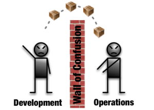
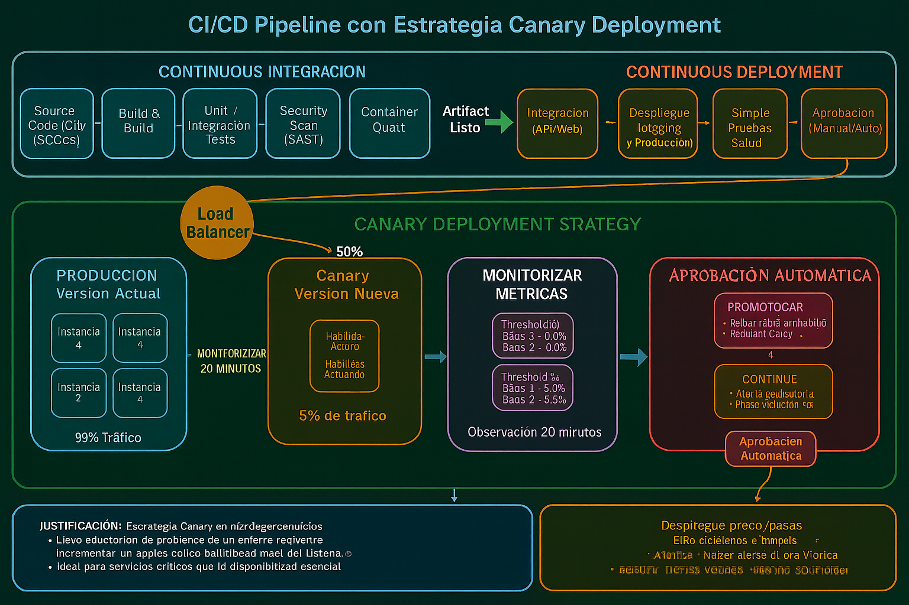
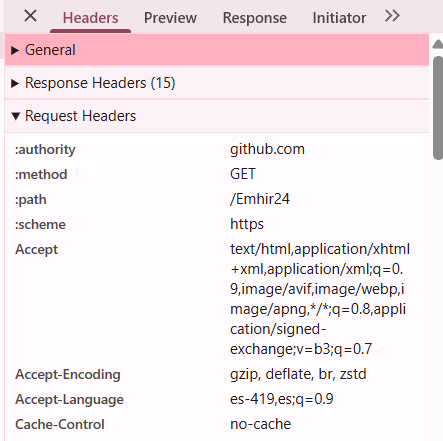
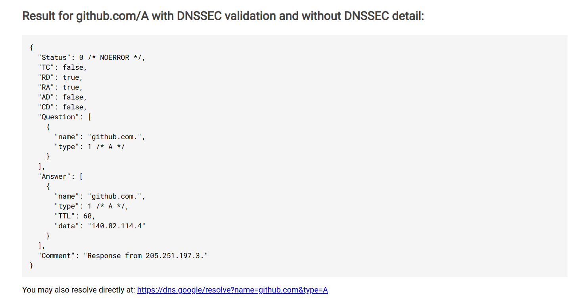
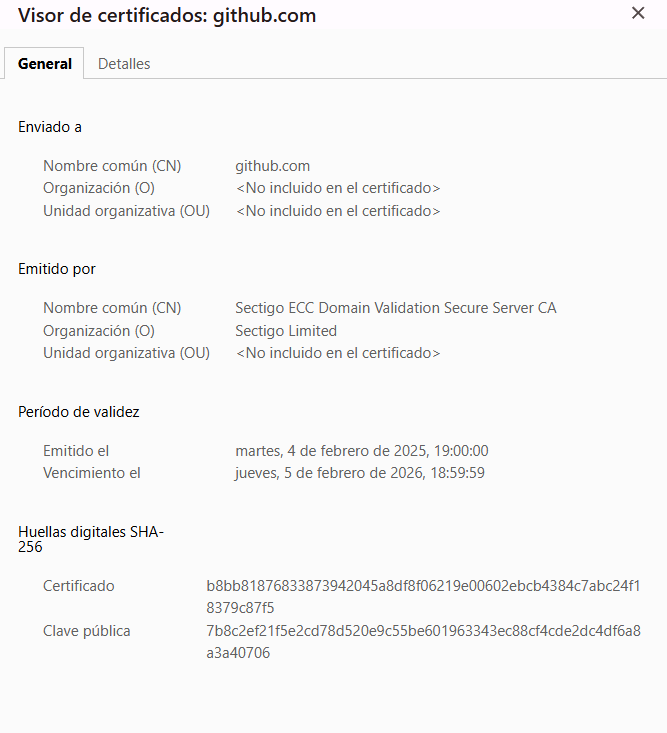
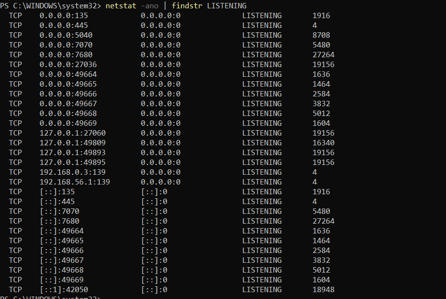
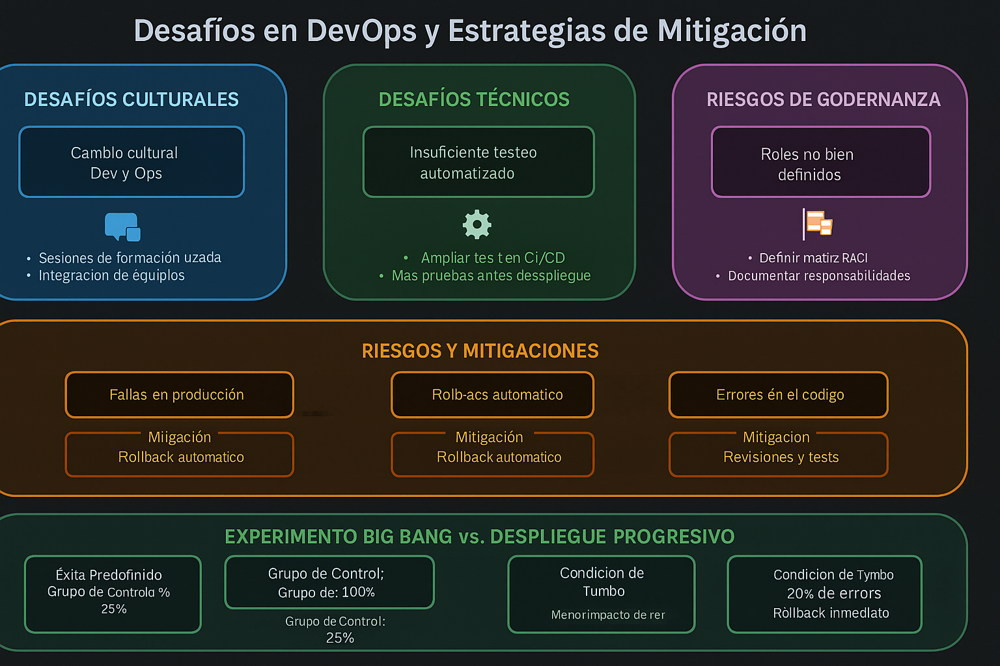
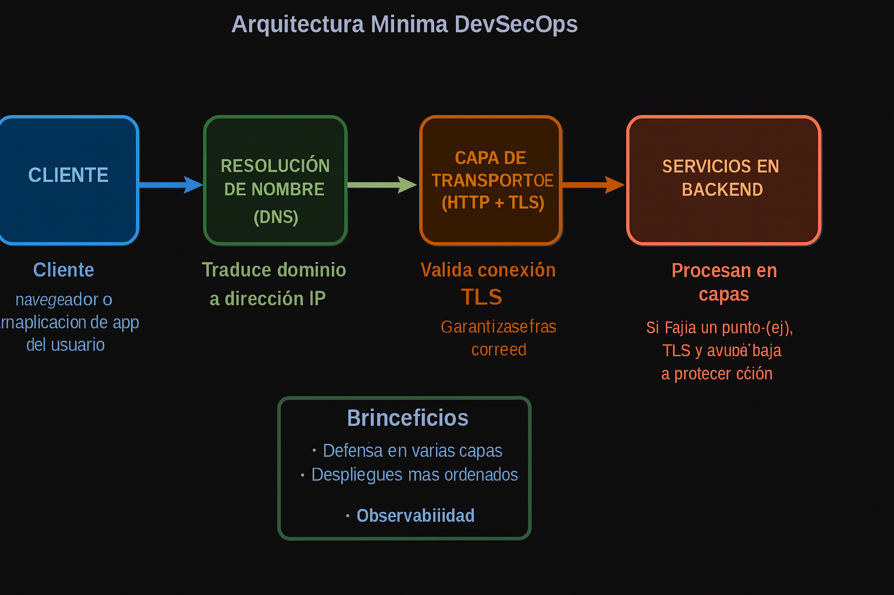

# Actividad 1: Introducción a DevOps y DevSecOps  

**Estudiante:** Emhir Rodríguez 
**Fecha:** 11/09/2025  
**Tiempo total invertido:** 06:00  

---

## Contexto del entorno  
El trabajo lo realicé en mi laptop con Windows 10, usando Visual Studio Code y el navegador Chrome.  
Para las evidencias utilicé herramientas básicas como DevTools (HTTP/TLS), nslookup (DNS) y netstat (puertos).  
  
## 4.1 DevOps vs Cascada tradicional  
**Explicación breve:**  
**cascada**: Este modelo sigue fases lineales; primero requisitos, luego diseño, después implementación, pruebas y recién al final despliegue.  
Funciona cuando los requisitos son estables, pero el problema es que el feedback llega tarde y corregir errores al final suele ser caro y lento.  

**DevOps**:Busca trabajar en ciclos más cortos y repetitivos. Se apoya en integración y despliegue continuo (CI/CD), pruebas automatizadas y colaboración entre desarrollo y operaciones. Esto permite detectar fallos antes, entregar más rápido y adaptarse mejor a los cambios.  

**Situaciones donde cascada todavía se usa:**  
1. Proyectos que requieren certificaciones formales (ejemplo: software médico o aeronáutico).  
2. Sistemas que dependen mucho de hardware y donde rehacer pruebas es costoso.  

**Diferencia clave:** cascada da más control y formalidad, pero a costa de tiempo; DevOps gana velocidad y flexibilidad, aunque exige disciplina y automatización.  

**Tabla comparativa:**

| Aspecto      | Cascada                | DevOps                |
|--------------|------------------------|-----------------------|
| Estructura   | Lineal, por fases      | Cíclica e iterativa   |
| Feedback     | Al final del ciclo     | En cada iteración     |
| Flexibilidad | Baja, rígida           | Alta, adaptable       |
| Velocidad    | Lenta                  | Rápida                |
| Riesgo       | Alto                   | Menor (fallos detectados antes) |

## 4.2 Ciclo tradicional y silos
En el enfoque clásico de desarrollo, lo normal era que el trabajo terminara en la fase de construcción y recién ahí pasara al área de operaciones.  
Al no haber comunicación constante, cada grupo avanzaba por su cuenta como si estuvieran en silos, lo cual genera varios problemas.

**Limitaciones que aparecen:**
1. **Cambios grandes y poco controlados:** en lugar de probar pequeños ajustes, se entrega un bloque completo de código. Si algo falla, encontrar la causa se vuelve complicado y corregirlo es más caro.  
2. **Acumulación de errores:** al no recibir retroalimentación inmediata, se van sumando defectos que después llegan todos juntos al final del ciclo.

**Anti-patrones típicos:**
**“Lanzar la pelota”:** los devs entregan el sistema y se desligan, esperando que operaciones lo ponga en marcha. Esto causa reprocesos y malentendidos porque el equipo que recibe no estuvo involucrado antes.  
**Seguridad atrasada:** se revisa la seguridad como un trámite final. Esto retrasa la entrega y deja abierta la posibilidad de que vulnerabilidades pasen a producción.

**Consecuencia directa:**  
Este modelo crea muchos *handoffs* (pases entre equipos) con pérdida de información. El resultado son tiempos más largos para resolver incidentes (**MTTR**) y repeticiones de los mismos problemas en distintos despliegues.

## 4.3 Principios y beneficios de DevOps (CI/CD, Agile, colaboración)

El corazón de DevOps está en la integración continua (CI) y la entrega continua (CD).  
En lugar de esperar semanas para juntar cambios grandes, se trabaja con modificaciones pequeñas que se integran y prueban casi de inmediato. Esto ayuda a detectar errores cerca del código original y facilita la colaboración entre equipos.

**Puntos clave de CI/CD:**
Cambios chicos y frecuentes en vez de grandes lotes.  
Pruebas automatizadas que corren apenas se sube el código.  
Un pipeline que promueve o bloquea el paso de versiones según los resultados.  

**Relación con Agile:**  
Prácticas ágiles como las reuniones diarias o las retrospectivas ayudan a que Dev y Ops tomen decisiones rápidas sobre el pipeline.  
Por ejemplo: en una retro se puede acordar que cierto tipo de errores ya no se pasen de pruebas a producción. De esa forma, Agile y DevOps se refuerzan mutuamente.

**Indicador de colaboración (ejemplo no financiero):**  
Tiempo desde que un pull request está listo hasta que se despliega en el entorno de pruebas.*  
Si tarda mucho, significa que la comunicación entre Dev y Ops no es fluida.  
Si se mantiene corto, quiere decir que hay coordinación real.  

**Cómo medirlo sin herramientas caras:**  
Revisar los registros de PRs en GitHub o GitLab.  
Mirar los logs de despliegue en el servidor.  
Llevar una bitácora manual con las horas de aprobación y despliegue.

## 4.4 Evolución a DevSecOps

El paso de DevOps a DevSecOps significa que la seguridad ya no se revisa al final, sino que está presente desde el inicio del pipeline.  
Se aplican pruebas estáticas y dinámicas que permiten encontrar fallas antes de que el software llegue a producción.

**Tipos de análisis:**

**SAST (Static Application Security Testing):** revisa el código fuente o los binarios antes de ejecutar. Sirve para detectar inyecciones, malas prácticas o uso de librerías vulnerables.  
**DAST (Dynamic Application Security Testing):** analiza la aplicación *en ejecución*, simulando ataques reales (por ejemplo, XSS o SQL Injection).

**Gate mínimo de seguridad (umbrales propuestos):**
SAST → 0 vulnerabilidades críticas o altas(CVSS ≥ 7.0).  
DAST → mínimo 80% de cobertura en rutas críticas de la API.  

Si no se cumplen, el pipeline debe detener la promoción de esa versión.

**Política de excepción:**  
En caso de que no se pueda corregir de inmediato:
 Se permite una excepción de máximo **7 días**.  
 Se asigna un responsable técnico.  
 Se debe dejar documentado un plan de corrección (ejemplo: aplicar parche temporal o mitigación con firewall).

**Cómo evitar el “teatro de seguridad”:**  
No basta con cumplir checklist. Dos señales de eficacia que sí miden impacto real son:  
1. **Reducción de hallazgos repetidos:** que las mismas vulnerabilidades no vuelvan a aparecer en cada despliegue.  
2. **Tiempo de remediación más corto:** que una vulnerabilidad crítica se cierre en menos de 48 horas desde que se detecta.

Estas métricas se pueden obtener comparando reportes de SAST/DAST y revisando los commits de corrección.

## 4.5 CI/CD y estrategias de despliegue
Cuando se trata de un servicio clave como el de inicio de sesión, no conviene arriesgarse a desplegar todo de golpe.  
Por eso, una buena práctica es usar el método canario, que consiste en liberar la nueva versión solo a una parte pequeña de los usuarios.  
Si la versión es estable, se amplía el alcance hasta cubrir al 100%. Si aparecen fallos, se revierte rápido y la mayoría de usuarios nunca lo nota.

**Riesgos que pueden surgir y cómo se controlan:**
- **Errores en funciones básicas:** antes de enviar a todos, se validan contratos de API y pruebas de integración.  
- **Mayor costo en infraestructura:** mantener dos versiones en paralelo solo por un tiempo corto para evitar gastos innecesarios.  
- **Sesiones interrumpidas:** aplicar *drain connections* y cuidar que los cambios de base de datos sean compatibles.

**Indicadores para decidir si avanzar o no:**
- **KPI técnico:** porcentaje de respuestas 5xx ≤ 0.1% en la primera hora del despliegue.  
- **KPI de producto:** tasa de conversión (ejemplo: usuarios que completan registro) no debe bajar más del 5% respecto al promedio anterior.

**Comentario:**  
Es importante mirar tanto lo técnico como lo funcional. Puede pasar que el sistema no marque errores 5xx, pero que los usuarios abandonen el flujo porque algo cambió en la interfaz o en la lógica.  
Por eso ambos tipos de métricas deben coexistir al momento de tomar la decisión.

### 4.6 Fundamentos prácticos 
### 1. HTTP – contrato observable
Para esta evidencia revisé una petición HTTP en GitHub usando las DevTools del navegador.  

En la captura se observa:

**Método:** GET  
**Código de estado:** 200 OK  
**Cabecera 1:** `Cache-Control: no-cache` → obliga al cliente a validar siempre con el servidor, lo que asegura información actualizada pero puede aumentar la carga.  
**Cabecera 2:** `Accept-Encoding: gzip, deflate, br, zstd` → habilita compresión en la respuesta, optimizando el uso de red y reduciendo tiempos de carga.

**Interpretación:**  
Estas cabeceras muestran un balance entre consistencia y rendimiento: aunque se fuerza a revalidar (menos caché), la compresión mantiene la respuesta rápida y ligera. Esto da trazabilidad y control sobre la entrega de contenido.

### 2. DNS – registro y TTL
Consulté el dominio **github.com** para revisar su resolución DNS.  

En la evidencia (`imagenes/dns-ttl.png`) se observa:
- **Registro:** A  
- **Dirección IP:** 140.82.114.3  
- **TTL:** 60 segundos

**Interpretación:**  
El TTL de 60s indica que los clientes solo guardan la respuesta en caché por un minuto.  
Esto permite reaccionar rápido a cambios (como un rollback de despliegue), pero aumenta la carga en servidores DNS.  
Un TTL más largo sería útil para dominios muy estables, reduciendo tráfico de consultas.

### 3. TLS – certificado digital

Revisé el certificado digital de github.com desde el navegador.  

En la evidencia (`imagenes/tls-cert.png`) se observa:

- **CN (Common Name):** github.com  
- **Emisor (CA):** Sectigo ECC Domain Validation Secure Server CA — Sectigo Limited  
- **Vigencia:** del 4 de febrero de 2025 al 5 de febrero de 2026  

**Interpretación:**  
El certificado garantiza que la conexión es segura y que el navegador puede validar la cadena de confianza.  
Si el certificado estuviera vencido o emitido por una CA no confiable, el navegador mostraría advertencias de “sitio no seguro”, lo que expone a riesgos de ataques **MITM (Man in the Middle)**.  
Además, la validez temporal obliga a que los administradores renueven el certificado para mantener la disponibilidad y confianza del servicio.

### 4. Puertos en ejecución
Al ejecutar el comando pude comprobar qué servicios están corriendo en mi equipo.  

En la captura (`imagenes/ejecucion.png`) aparecen varios puertos abiertos que están en escucha (LISTENING), lo cual confirma que hay procesos activos esperando conexiones.
Entre los resultados más relevantes se puede ver:

- **135 (RPC)** y **445 (SMB):** servicios internos de Windows usados para comunicación y compartir recursos en red.  
- **5040** y **7070/7680:** asociados a aplicaciones que interactúan con la red (por ejemplo navegadores o programas en segundo plano).  
- **Rango dinámico 49664–49669:** son puertos efímeros que Windows asigna automáticamente para conexiones temporales.  
- **127.0.0.1 (loopback):** muestra procesos escuchando solo en la máquina local.  
- **192.168.56.1:139:** corresponde a una interfaz de red virtual que también mantiene SMB habilitado.

**Interpretación:**  
El hecho de que estos puertos estén en LISTENING significa que el sistema está preparado para aceptar conexiones en dichos servicios.  
Si un puerto esperado no aparece, podría indicar que un servicio no inició correctamente; mientras que tener puertos innecesarios abiertos puede representar un riesgo de seguridad.  
Por eso es importante revisar periódicamente el estado de los puertos y deshabilitar aquellos que no sean esenciales para reducir la exposición del sistema.

### 4.6 Fundamentos prácticos — Principios 12-Factor

Los principios 12-Factor sirven como guía para construir aplicaciones listas para la nube. A continuación, relaciono algunos con lo que pude observar en las evidencias (HTTP, DNS, TLS y puertos):

**Port binding:** en la evidencia de puertos vimos que el sistema expone servicios como HTTP (80) y HTTPS (443). En una aplicación 12-Factor el puerto no debería estar fijo en el código, sino definido como variable de entorno (ejemplo: `PORT=8080`). Esto permite ejecutar la misma aplicación en distintos entornos sin tener que modificar el código fuente.  

- **Configuración externa:** parámetros sensibles como contraseñas, claves o endpoints no deben ir incrustados en el código ni en los repositorios. Lo correcto es gestionarlos fuera, en archivos de configuración o sistemas de variables de entorno. De esa forma, al cambiar de desarrollo a producción no hay riesgo de exponer secretos.  

- **Logs como flujo:** en lugar de guardar logs en archivos locales (que pueden perderse o rotarse manualmente), los 12-Factor recomiendan enviarlos a la salida estándar. Esto facilita centralizar registros en sistemas de monitoreo y detectar problemas como los errores 5xx o fallos de TLS que vimos antes.  

**Entornos replicables:** el mismo conjunto de dependencias debe existir en desarrollo, pruebas y producción. Así se evitan sorpresas como “funciona en mi máquina pero no en producción”. Los diagnósticos de HTTP, DNS y TLS sirven precisamente para comprobar que los entornos son consistentes.  

**Procesos independientes:** cada servicio corre como un proceso aislado. Esto se refleja en los puertos: cada aplicación escucha en el suyo. Si un puerto esperado no está en LISTENING, significa que el proceso no se levantó correctamente.  

**Interpretación:**  
La idea de aplicar los 12-Factor es lograr aplicaciones más portables, escalables y seguras. En la práctica, ayudan a que los despliegues sean reproducibles: mismo código, misma configuración por entorno y mismos logs accesibles. Eso reduce la posibilidad de errores y simplifica la detección de incidentes.

## 4.7 Desafíos de DevOps y mitigaciones

Al aplicar DevOps en proyectos reales aparecen distintos desafíos:

**Culturales:**  
- Resistencia al cambio: equipos acostumbrados al modelo tradicional pueden ver DevOps como más trabajo.  
- Comunicación débil entre Dev y Ops.  

**Técnicos:**  
- Falta de automatización en pruebas y despliegues.  
- Dificultad para integrar herramientas distintas (repos, CI/CD, monitoreo).  

**De gobernanza:**  
- Ausencia de políticas claras para excepciones de seguridad.  
- Dudas sobre responsabilidades cuando ocurre un incidente.

### Riesgos y mitigaciones

- **Rollback difícil:** si se despliega todo de golpe y falla, el tiempo de recuperación es alto.  
*Mitigación:* usar despliegues graduales o canarios con rollback automatizado.  

- **Blast radius amplio (impacto grande de un fallo):** un bug puede afectar a todos los usuarios.  
*Mitigación:* limitar el porcentaje de usuarios expuestos en cada fase del despliegue.  

- **Falta de revisión cruzada:** cambios entran a producción sin que otro equipo los valide.  
*Mitigación:* obligatoriedad de code review antes de mergear a main.  

### Experimento controlado

Para demostrar que el despliegue gradual reduce riesgos frente a un despliegue “big bang” se podría:

- **Métrica primaria:** tasa de errores 5xx en usuarios finales.  
- **Grupo control:** 100% de usuarios reciben la nueva versión de golpe.  
- **Grupo experimental:** 10% de usuarios reciben la versión nueva en modo canario, y si es estable se amplía.  
- **Criterio de éxito:** que el grupo experimental presente menos incidentes críticos y tiempos de recuperación más cortos.  
- **Plan de reversión:** si los errores superan el umbral definido (ej. 0.1% de respuestas 5xx), se corta el despliegue y se revierte a la versión anterior.

## 4.8 Arquitectura mínima

Para que una aplicación funcione de forma segura y sencilla bajo un enfoque DevSecOps, se puede pensar en una arquitectura mínima con las siguientes piezas:

**1. Cliente:**  
El punto de partida es el navegador o la app del usuario. Desde aquí salen las peticiones hacia el sistema.

**2. Resolución de nombre (DNS):**  
Traduce el dominio (por ejemplo, *github.com*) a la dirección IP real. Es importante usar configuraciones como TTL adecuados y, si se puede, DNSSEC para evitar respuestas falsas.

**3. Capa de transporte (HTTP + TLS):**  
Aquí se valida que la conexión sea segura. El protocolo HTTPS cifra la información y el certificado TLS garantiza que estamos hablando con el servidor correcto.

**4. Servicios en backend:**  
Son las aplicaciones que procesan las solicitudes. Además de la lógica de negocio, incluyen validaciones de seguridad, control de accesos y manejo de errores.

### Principios aplicados
- **Separación de configuración:** no poner contraseñas ni direcciones fijas en el código, sino en variables de entorno.  
- **Registros como flujo:** enviar los logs a un sistema central para detectar fallos rápido.  
- **Entornos consistentes:** que desarrollo, pruebas y producción tengan la misma configuración para evitar “funciona en mi máquina pero no en el server”.

### Beneficios
- **Defensa en varias capas:** si falla un punto (ej. DNS), TLS y backend aún ayudan a proteger.  
- **Despliegues más ordenados:** al replicar la misma estructura en todos los entornos se evitan sorpresas.  
- **Observabilidad:** gracias a los logs y métricas se puede saber qué pasa en cada capa sin depender solo de los usuarios para reportar errores.

## 4.9 Tabla de evidencias

| Evidencia              | Descripción breve                                                                 |
|-------------------------|----------------------------------------------------------------------------------|
| `http-evidencia.png`     | Captura de DevTools mostrando cabeceras HTTP y contrato observable.              |
| `dns-ttl.png`        | Resultado de consulta DNS (`nslookup`) con dirección IP resuelta y TTL asociado. |
| `tls_cert.png`          | Certificado TLS de github.com, con CN, emisor y fechas de validez.               |
| `ejecucion.png`   | Listado de puertos en estado LISTENING obtenidos con `netstat`.                  |
| `arquitectura_minima.png` | Diagrama de arquitectura mínima con cliente, DNS, TLS y backend.                 |

