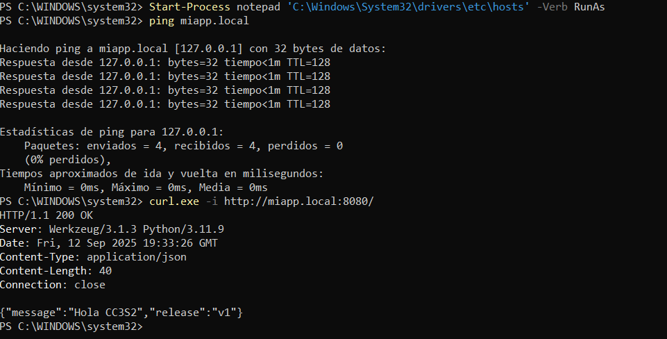

## Actividad 2: HTTP, DNS, TLS y 12-Factor
### Evidencias de Ejecución

#### 1. Aplicación Flask ejecutándose
La aplicación se levantó correctamente con variables de entorno (`PORT`, `MESSAGE`, `RELEASE`), mostrando que sigue el principio de configuración externa (12-Factor).  

#### 2. Prueba HTTP (GET)
Se realizó una petición con `curl -v http://127.0.0.1:8080/`, obteniendo respuesta `200 OK` y un JSON con el mensaje y la release.  

#### 3. Prueba HTTP (POST no soportado)
Al enviar un `POST` hacia `/`, la aplicación devolvió `405 METHOD NOT ALLOWED`. Esto confirma que solo se permite `GET` como estaba configurado en el código Flask.  

#### 4. Logs en stdout
Los logs se generan directamente en la salida estándar (stdout), cumpliendo con las prácticas 12-Factor (sin escribir a archivos locales).  

#### 5. Puertos en uso
Con `netstat -ano | findstr 8080` se comprobó que la aplicación está escuchando en el puerto configurado (`8080`).  

#### 6. Verificación DNS
Se configuró el archivo `hosts` para resolver `miapp.local` hacia `127.0.0.1`. Con `ping` y `curl` se validó que la app responde por ese nombre.  

#### 7. Verificación general
Se integraron pruebas de **hosts, DNS, HTTP y puertos** en una sola ejecución, confirmando la resolución correcta y la respuesta de la aplicación.  

