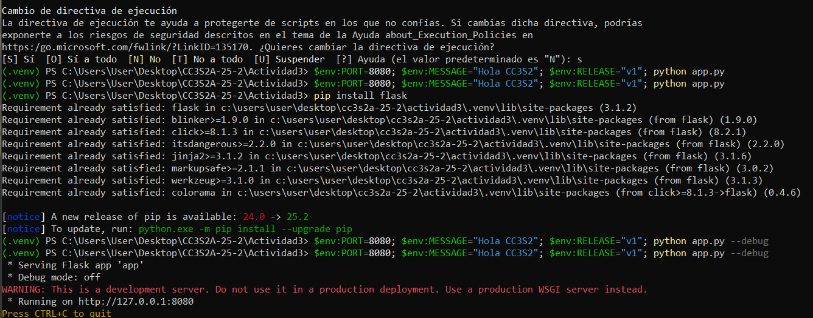
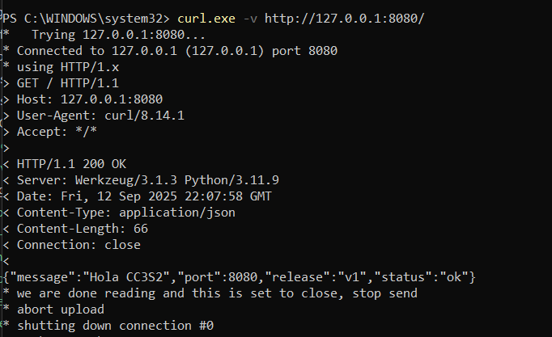
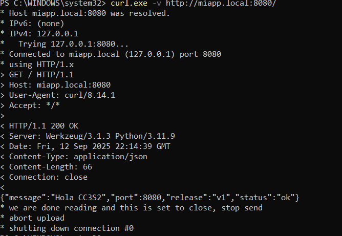

# Actividad 3 – DevOps, DevSecOps, HTTP, DNS, TLS y 12-Factor App
## Parte teórica
### 1. ¿Qué entendemos por DevOps?
DevOps no se limita a instalar herramientas o a usar scripts; representa una forma de trabajo donde desarrollo y operaciones se coordinan.  
La clave es la automatización, la colaboracióny la retroalimentación continua.  

En nuestro laboratorio se evidencia al:
- Ejecutar la aplicación con variables de entorno.  
- Usar `Makefile` para centralizar comandos repetitivos.  
- Montar un *reverse proxy* con Nginx y protegerlo con certificados TLS.  

Esto permite ilustrar el principio: “si lo construyes, también lo mantienes”.

### 2. Marco CALMS aplicado
- **Cultura**: todos trabajamos sobre la misma base (`systemd`, `nginx`, `hosts`).  
- **Automatización**: un solo `make run` levanta la aplicación, en lugar de escribir largos comandos manuales.  
- **Lean**: evitamos pasos redundantes con tareas idempotentes.  
- **Medición**: los accesos se registran como logs tanto en la consola de Flask como en Nginx.  
- **Sharing**: configuraciones (`miapp.conf`, certificados) son reutilizables por cualquiera del equipo.  

### 3. DevSecOps en práctica
En esta actividad se incorporó seguridad desde el inicio:  
- El tráfico pasa por **TLS**, usando certificados generados con OpenSSL.  
- Nginx redirige automáticamente de HTTP (80) a HTTPS (443).  
- Se exige al cliente conectarse de manera cifrada, aplicando *security by design*.  

### 4. Principios de la 12-Factor App en la app Flask
- **Config en el entorno**: parámetros como `PORT`, `MESSAGE` y `RELEASE` se leen como variables de entorno.  
- **Port binding**: la aplicación expone un puerto (8080) sin depender de servidores externos.  
- **Logs como flujo de eventos**: lo que ocurre en la app aparece en `stdout`.  
- **Procesos sin estado**: la aplicación no guarda datos en disco, lo que facilita escalarla o reiniciarla.  

## Parte práctica y evidencias

A continuación se muestran los pasos realizados con sus capturas correspondientes:

### 1. Aplicación Flask ejecutándose
Se definieron las variables y se levantó la app:

```bash
PORT=8080 MESSAGE="Hola CC3S2" RELEASE="v1" python3 app.py
 ```



### 2. Consulta HTTP local

Validamos la respuesta por HTTP con curl:

curl -v http://127.0.0.1:8080


### 3.Resolución de DNS

Confirmamos que miapp.local apunta al localhost:

cat /etc/hosts | grep miapp.local



### 4. Prueba con método POST

Enviamos una petición no definida y verificamos el manejo de errores:

curl -X POST http://127.0.0.1:8080


### 5. Logs en consola (stdout)

Durante la ejecución, la aplicación reporta los accesos y errores directamente en la terminal.

### 6. Registros de Nginx

Después de configurar el reverse proxy con TLS, Nginx empieza a registrar accesos HTTPS.

### 7. Puertos abiertos

Comprobamos que Flask está en el puerto 8080 y Nginx escucha en 443:

sudo ss -lntp | grep -E ':443|:8080'


### 8. Verificación TLS

Se inspeccionó la conexión cifrada:

openssl s_client -connect miapp.local:443 -servername miapp.local


#### 9. Verificación TLS

### Reflexión final

Esta actividad permitió comprobar cómo DevOps y DevSecOps no son conceptos abstractos, sino prácticas tangibles:

Automatizar con make facilita la reproducibilidad.

Los principios 12-Factor se reflejan en la pequeña aplicación Flask.

TLS y Nginx garantizan seguridad y escalabilidad.

El resultado es un flujo de trabajo más confiable, con seguridad incorporada y con tareas fácilmente replicables por cualquier integrante del equipo.