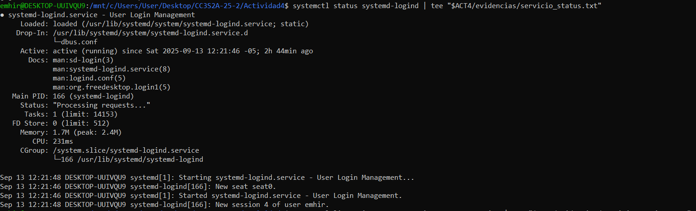
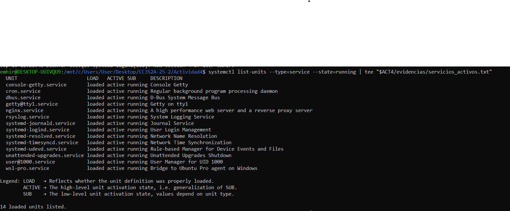
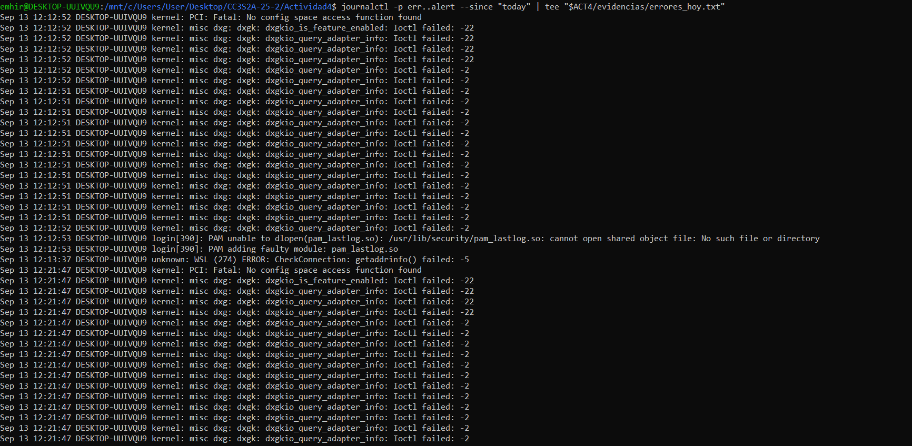

# Actividad 4 – Introducción a herramientas CLI en entornos Unix-like para DevSecOps

## Sección 1: Manejo sólido de CLI
En esta primera parte se practicaron los fundamentos del uso de la línea de comandos en entornos Unix-like, con énfasis en navegación, globbing, tuberías, redirecciones y `xargs`.

### 1. Navegación básica

En esta parte se evidencia cómo moverse entre directorios y listar archivos.

```bash
pwd | tee -a $ACT4/evidencias/pwd.txt
ls -la | tee "$ACT4/evidencias/listado_inicial.txt"
cd /tmp
pwd | tee -a "$ACT4/evidencias/pwd.txt"
### 1.2 Creación de archivos y globbing
- Se creó un directorio temporal `tmp-cli` con tres archivos (`archivo1.txt`, `archivo2.txt`, `archivo3.doc`).  
- Se listaron los archivos con patrón `archivo*.txt`.  
```
Evidencia: `globbing_archivos_txt.txt`

### 2. Globbing
Se crean archivos de prueba y se utilizan patrones para listarlos.
```bash
mkdir -p "$ACT4/tmp-cli" && cd "$ACT4/tmp-cli"
touch archivo1.txt archivo2.txt archivo3.doc

ls archivo*.txt | tee "$ACT4/evidencias/globbing_archivos_txt.txt"
```
Evidencias generadas:

`globbing_archivos_txt.txt`

### 3. Tuberías (Pipes)

Se combina ls con wc para contar archivos.
```bash
ls | wc -l | tee "$ACT4/evidencias/total_en_tmp_cli.txt"
```

Evidencias generadas:`total_en_tmp_cli.txt`

### 4. Redirecciones

Ejemplo de guardar salidas en archivos, añadir texto y manejar errores.
```bash
ls > "$ACT4/evidencias/lista.txt"
printf "Hola\n" >> "$ACT4/evidencias/lista.txt"
wc -l < "$ACT4/evidencias/lista.txt" | tee "$ACT4/evidencias/lista_lines.txt"
ls noexiste 2> "$ACT4/evidencias/errores.txt" || true
```

bashEvidencias generadas:

`bashlista.txt`

`bashlista_lines.txt`

`basherrores.txt`

#### 5. Uso de xargs

Se prepara un borrado seguro usando find y xargs en modo dry-run.
```bash
find . -maxdepth 1 -name 'archivo*.txt' -print0 | xargs -0 echo rm -- \
| tee "$ACT4/evidencias/xargs_dry_run.txt"
```
Evidencias generadas:```bashxargs_dry_run.txt```

## SECCIÓN 2: Administración Básica

En esta sección se revisa la administración básica en Unix-like: usuarios, grupos, permisos y procesos.  
Los comandos se ejecutaron en **Ubuntu WSL2** y las evidencias se guardaron en la carpeta `Actividad4/evidencias`.


### 1. Usuarios, Grupos y Permisos

Primero verificamos el usuario actual y sus grupos:

```bash
whoami
id
```
Output registrado en evidencias:

```bash
whoami -> emhir
id -> uid=1000(emhir) gid=1000(emhir) groups=1000(emhir),27(sudo),100(users) ...
```
Luego se creó un usuario nuevo llamado devsec y un grupo llamado ops, añadiendo al usuario al grupo:

```bash
sudo adduser devsec
sudo addgroup ops
sudo usermod -aG ops devsec
```
Durante el proceso de creación se pidió contraseña y confirmación de datos, los cuales quedaron registrados en el sistema.

Se creó un archivo de prueba llamado secreto.txt, asignándole al usuario devsec y grupo ops como propietarios, con permisos 640 (lectura/escritura para dueño, lectura para grupo, sin acceso para otros):

```bash
touch evidencias/secreto.txt
sudo chown devsec:ops evidencias/secreto.txt
sudo chmod 640 evidencias/secreto.txt
ls -l evidencias/secreto.txt
```
Output:
```bash
-rw-r----- 1 devsec ops 0 Sep 13 14:15 secreto.txt
```
Con esto se comprueba la correcta aplicación del principio de menor privilegio, permitiendo únicamente a los usuarios autorizados leer el archivo.

### 2. Procesos y señales

En esta sección se ejemplifica la gestión de procesos en segundo plano y cómo enviarles señales para terminarlos de manera controlada.  
Se utilizó un proceso simple (`sleep`) para evitar riesgos en el sistema.

1. **Crear un proceso en segundo plano**

Con el siguiente comando se ejecuta `sleep 100` en background, lo que devuelve un identificador de proceso (PID):

```bash
sleep 100 &
```
2. **Listar procesos activos**

Para verificar el proceso en ejecución, se utiliza ps aux | grep sleep, que muestra el PID y estado del proceso.
La salida se guardó en el ```archivo procesos.txt.```
```bash

ps aux | grep sleep | tee "$ACT4/evidencias/procesos.txt"
```
3. **Consultar con jobs**

El comando jobs -l permite visualizar los procesos en segundo plano asociados a la sesión actual.
La salida inicial se guardó en ```jobs.txt.```
```bash
jobs -l | tee "$ACT4/evidencias/jobs.txt"
```

4. **Enviar señal para terminar el proceso**

Se utilizó el comando kill con la señal SIGTERM para detener el proceso de manera segura.
En este caso, el PID del proceso fue 581.
```bash
kill -SIGTERM 581
```

5. **Confirmar la finalización**

Con jobs -l se verifica nuevamente el estado de los procesos.
La salida se registró en ```jobs_after.txt```, donde se observa que el proceso ya no se encuentra en ejecución.
```bash
jobs -l | tee "$ACT4/evidencias/jobs_after.txt"
```

### 3.systemd (Logs y Servicios)

En esta sección se revisa el manejo de servicios y registros del sistema con **systemd** y **journalctl**.

1. **Estado de un servicio específico**
Se inspeccionó el estado del servicio `systemd-logind` mostrando que está activo y corriendo en segundo plano.

```bash
systemctl status systemd-logind | tee "$ACT4/evidencias/servicio_status.txt"
```
Evidencia:



2. **Servicios activos**
Se listaron todos los servicios actualmente en ejecución en el sistema:

```bash
systemctl list-units --type=service --state=running | tee "$ACT4/evidencias/servicios_activos.txt"
```
Evidencia:


3. **Logs de errores recientes**
Se consultaron los logs de sistema, filtrando solo errores (err y alert) desde el día de hoy:

```bash
journalctl -p err..alert --since "today" | tee "$ACT4/evidencias/errores_hoy.txt"
```
Evidencia:


**Reflexión de la sección**
El uso de systemd permite gestionar y monitorear servicios de forma centralizada, mientras que journalctl facilita la inspección de logs en tiempo real.
De esta manera se puede garantizar el correcto funcionamiento de procesos críticos y detectar errores en el sistema de forma temprana.

## SECCIÓN 3: Utilidades de texto de Unix

En esta sección se analiza y estudia el uso de utilidades clásicas de Unix para el procesamiento de texto, fundamentales en el enfoque de **DevSecOps** ya que permiten auditar logs, transformar datos y automatizar búsquedas de información sensible.

### 1. Uso de `grep` para buscar patrones de archivo

```bash
grep root /etc/passwd | tee evidencias/grep_root.txt
```
Este comando realiza una búsqueda de la palabra root en el archivo ```/etc/passwd```, el cual contiene la lista de usuarios del sistema.
El objetivo es localizar rápidamente las entradas relacionadas con el usuario administrador.

2. **Uso de sed para sustitución de datos**
```bash
printf "linea1: dato1\nlinea2: dato2\n" > evidencias/datos.txt
sed 's/dato1/secreto/' evidencias/datos.txt | tee evidencias/nuevo.txt
```
Con ```sed``` se reemplaza la primera ocurrencia de dato1 por secreto en cada línea.
El resultado modificado se guarda en ```nuevo.txt.```

3. **Uso de awk y cut**
```bash
awk -F: '{print $1}' /etc/passwd | sort | uniq | tee evidencias/usuarios_awk.txt
cut -d: -f1 /etc/passwd | sort | uniq | tee evidencias/usuarios_cut.txt
```
Ambos comandos extraen la primera columna del archivo ```/etc/passwd```.

```awk``` permite mayor flexibilidad para procesar campos.

```cut``` es más rápido y sencillo para separar por delimitadores.

4. **Uso de sort y uniq**
```bash
cat evidencias/*.txt | sort | uniq | tee evidencias/sort_uniq.txt
```
Aquí se concatenan varios archivos .txt, se ordenan con sort y se eliminan duplicados con uniq.

5. **Uso de tr y tee**
```bash
printf "hola\n" | tr 'a-z' 'A-Z' | tee evidencias/mayus.txt
```
El comando ```tr``` convierte caracteres en minúscula a mayúscula, mientras que tee permite guardar el resultado en ```mayus.txt``` y mostrarlo en pantalla al mismo tiempo.

6. **Uso de find para búsqueda de ficheros**
```bash
find /tmp -mtime -5 -type f -printf '%TY-%Tm-%Td %TT %p\n' | sort | tee evidencias/find_tmp.txt
```

Busca en ```/tmp``` archivos modificados en los últimos 5 días, mostrando fecha, hora y ruta completa.
Esto es útil para auditorías rápidas de cambios recientes.

***EJERCICIOS DE REFORZAMIENTO***

A continuación, se ejecutan varios ejercicios que integran los comandos de esta sección:

```bash
# Buscar ocurrencias de root en /etc/passwd
grep root /etc/passwd

# Sustitución con sed
sed 's/dato1/secreto/' evidencias/datos.txt > evidencias/nuevo.txt

# Extracción de usuarios con awk y cut
awk -F: '{print $1}' /etc/passwd | sort | uniq
cut -d: -f1 /etc/passwd | sort | uniq

# Conversión de texto a mayúsculas con tr y tee
printf "hola\n" | tr 'a-z' 'A-Z' | tee evidencias/mayus.txt

# Conteo de archivos que contengan "conf" en /etc
ls /etc | grep conf | sort | tee evidencias/lista_conf.txt | wc -l

# Detección de errores en sesiones capturadas
grep -Ei 'error|fail' evidencias/sesion.txt | tee evidencias/hallazgos.txt
```
***Explicación rápida de los ejercicios:***

```grep root /etc/passwd``` → Busca las líneas que contienen la palabra root.

```sed 's/dato1/secreto/' datos.txt``` → Reemplaza dato1 por secreto y guarda el resultado.

```awk / cut ```→ Extraen los nombres de usuario del sistema eliminando duplicados.

```tr``` → Convierte la palabra hola en mayúsculas.

```s /etc | grep conf ```→ Filtra archivos de configuración en /etc y los guarda en lista_conf.txt.

```grep -Ei 'error|fail' ```evidencias/sesion.txt → Busca líneas con error o fail, útil para auditoría de logs.